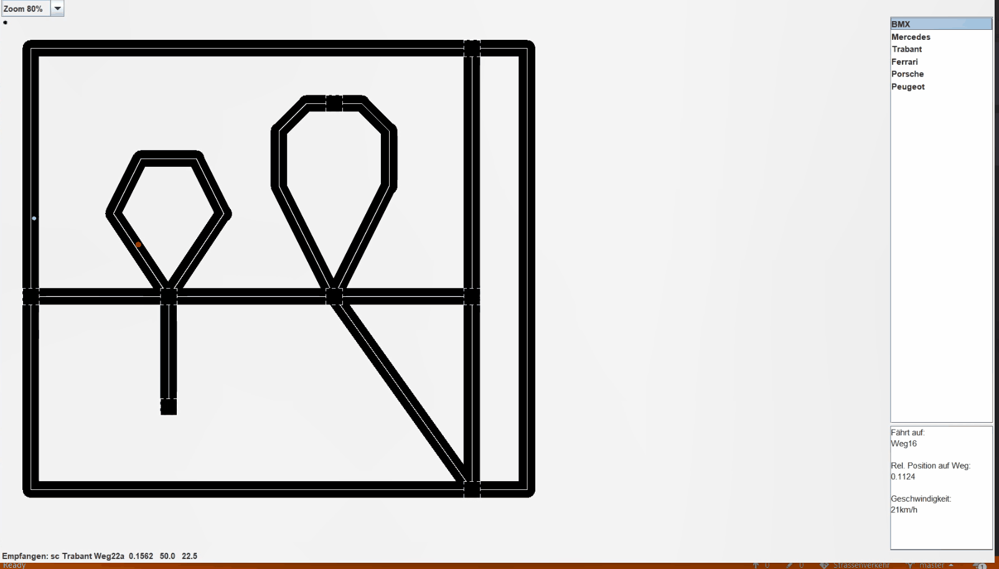

# Car Simulator 🚗

This repository contains the files of the project Road Traffic from the internship Computer Science 2 in the degree program Electrical Engineering, Information Technology and Computer Engineering at RWTH Aachen University



<!-- TABLE OF CONTENTS -->

## :ledger: Index

<details open="open">
  <summary>Table of Contents</summary>
  <ol>
    <li>
      <a href="#beginner-motivation">Motivation</a>
    </li>
    <li>
     <a href="#hammer-built-with">Built With</a>
    </li>
    <li>
      <a href="#zap-getting-started">Getting Started</a>
      <ul>
        <li><a href="#electric_plug-installation">Installation</a></li>
      </ul>
    </li>
  </ol>
</details>

## :beginner: Motivation

* During the practical course, all essential elements of object-oriented software development and their implementation in the C++ language are to be used and practiced on a (simplified) example.

* For the representation of used data structures like Vektor, list or associative memory, the classes of the STL (Standard Template Library) are to be
learned and used

## :hammer: Built With

- C++

<!-- GETTING STARTED -->

## :zap: Getting Started

| Datei/Verzeichnis     | Verwendung                 |
|-----------------------|----------------------------|
| `Aufgabenblock_1`     | Aufgabe 1, 1d, 2, 3        |
| `Aufgabenblock_2`     | Aufgabe 4, 5, 6, 6a        |
| `Aufgabenblock_3`     | Aufgabe 7, 8, 9a, 9b, 9c   |
| `Strassenverkehr.sln` | Visual Studio Projektmappe |
| `README.md`           | Diese Datei                |

- For the processing of task block 2 and 3 additional files are required and needed to use the simulation server (SimuServer) and to establish a connection.

| Datei            | Ordner                               |
|------------------|--------------------------------------|
| `SimuClient.h`   | Projektverzeichnis (Aufgabenblock_X) |
| `SimuClient.lib` | Projektverzeichnis (Aufgabenblock_X) |
| `SimuClient.dll` | Arbeitsverzeichnis (Debug|Release)   |
| `SimuServer.jar` | Projektverzeichnis (Aufgabenblock_X) |

- In addition, task block 3 requires the data files `VO.dat`, `Simu.dat` and
SimuDisplay.dat`, which can also be stored in the project directory.

### :electric_plug: Installation

```bash
git clone https://github.com/dkevin96/carsimulation.git
open .sln file , build -> run
```

Additional Information
---------------------

[Institutswebseite (ACS)](https://www.acs.eonerc.rwth-aachen.de/go/id/fzml)
